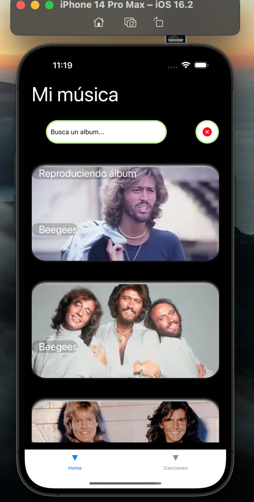
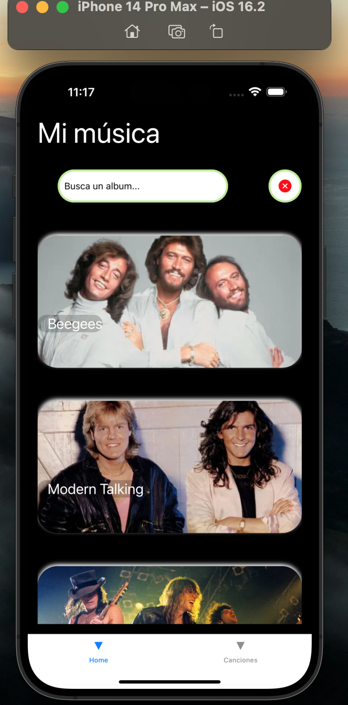
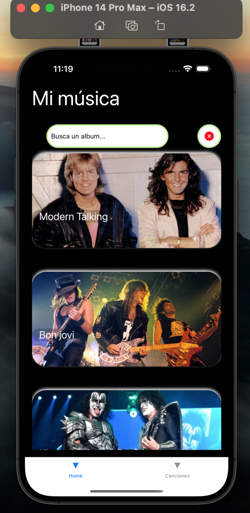
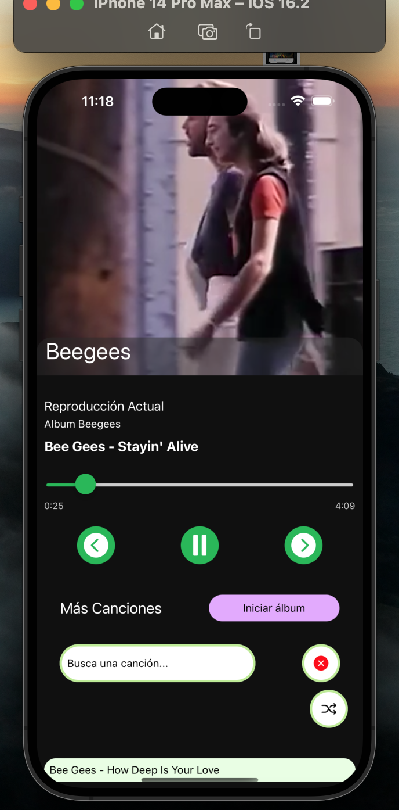
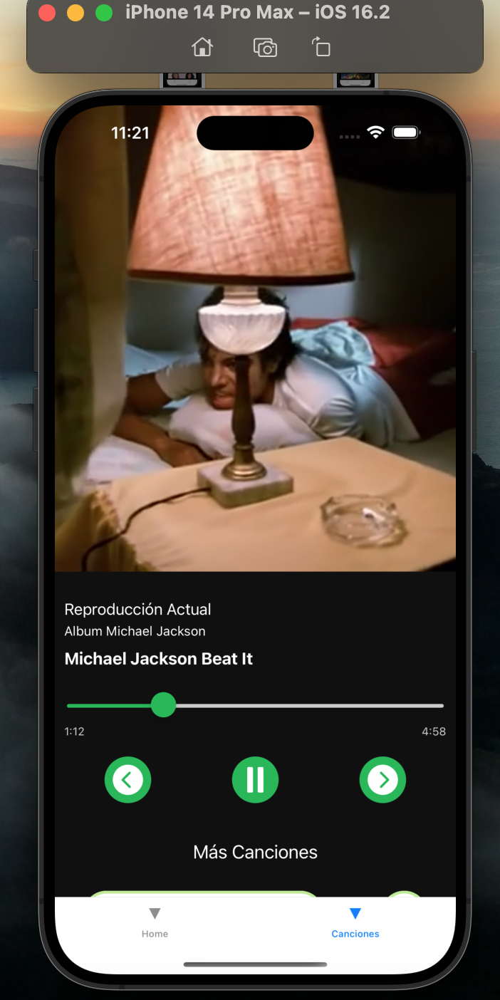
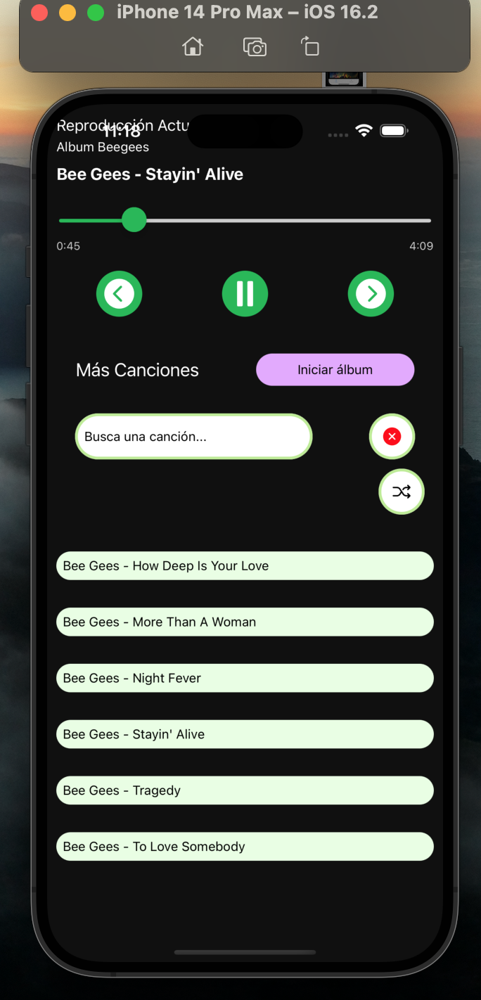

# Music-player

Aplicación reproductor de música hecha en react native con expo y typescript

Nota: 

Los videos y canciones fueron de forma local en el proyecto, los cuales no fueron inlcuidos en el repositorio, por lo que 
no se espera el uso fácil o directo de esta aplicación por terceros. El objetivo de este repositorio es conocer el código y el proyecto.

Mostrar imagen en README

